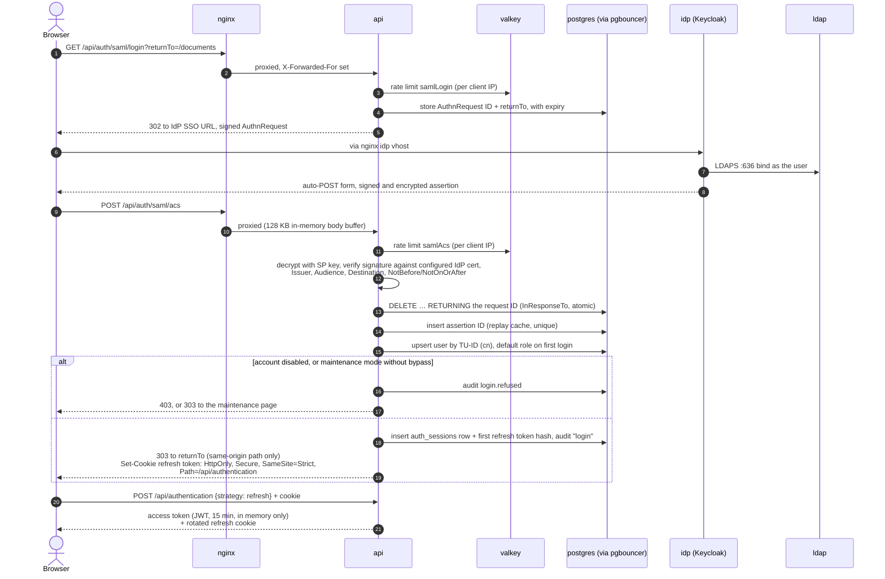
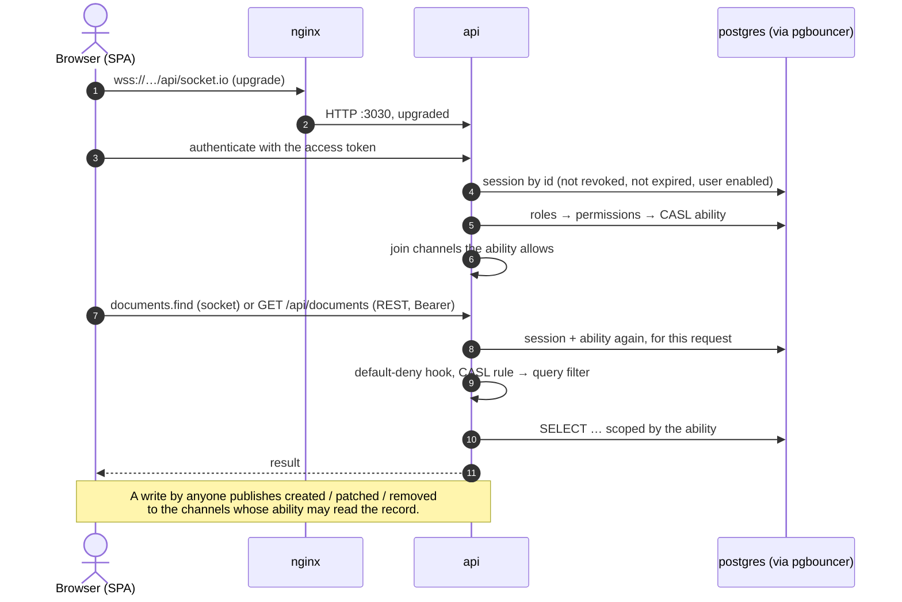
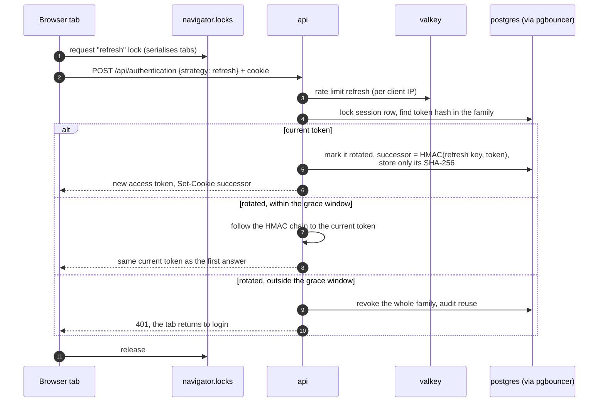
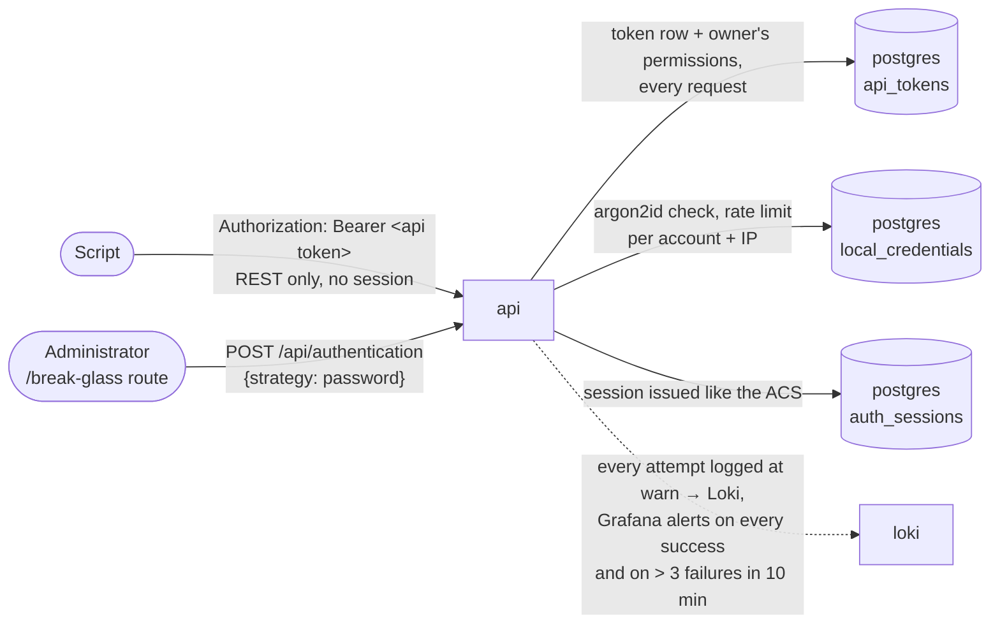

# Authentication and requests

Illustrates [0008](../0008-authentication-saml2-ldap.md), [0010](../0010-sessions-postgres-ratelimits-valkey.md), [0011](../0011-casl-role-authorization.md), [0012](../0012-role-scoped-channels.md) and [0029](../0029-api-tokens.md). Where this page and an ADR or the code disagree, the ADR and the code win.

Every request from the browser goes through `nginx :8443`; it is left out of the arrows below unless it does something itself. PostgreSQL is always reached through PgBouncer.

## SAML2 login

Locally the IdP is Keycloak behind `idp.localhost`, federating the `ldap` container; in production it is the university IdP. The application code is identical.

## Authenticated REST call and WebSocket

Every authenticated request, REST or WebSocket, re-reads the session row and the user's permissions, so logout, disabling an account and role changes take effect on the next request.

## Refresh, rotation and reuse

## API tokens and break-glass

Two other ways in, both REST only:

