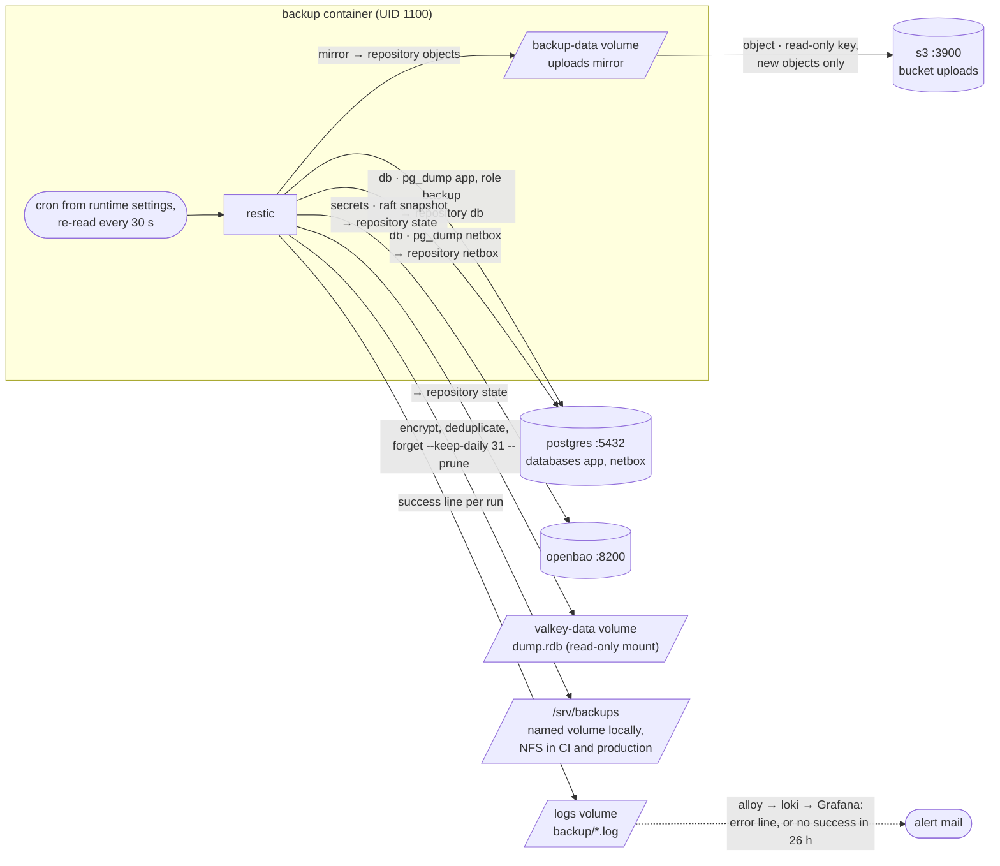
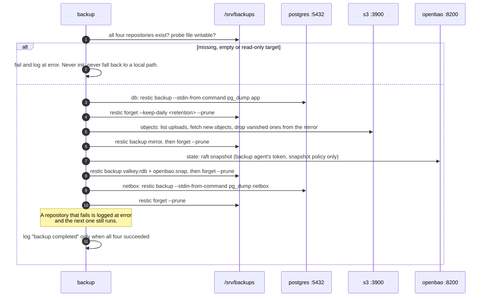
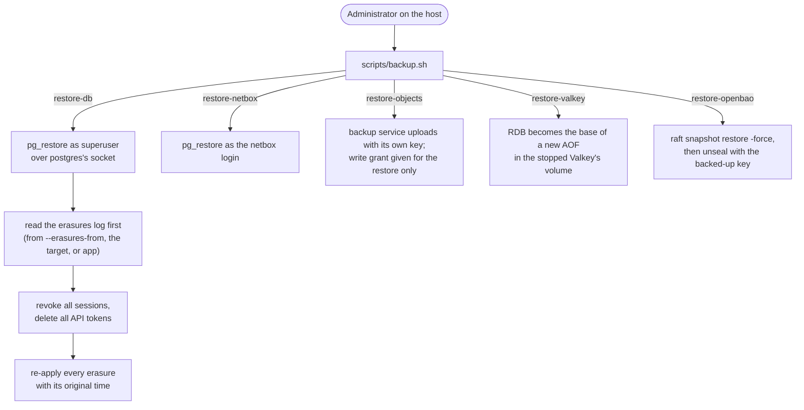

# Backup and restore

Illustrates [0017](../0017-nfs-backup-storage.md), with the Valkey snapshot from [0010](../0010-sessions-postgres-ratelimits-valkey.md) and the OpenBao snapshot from [0023](../0023-secrets-management.md). Where this page and an ADR or the code disagree, the ADR and the code win.

## What a run reads and writes

The `backup` service is on `db`, `object` and `secrets` only, so it has no route to the API, the worker or Valkey. It reads Valkey's snapshot from a read-only volume mount instead.

The `exports` bucket is never backed up: exports can be regenerated, and must not outlive their retention in a snapshot.

## One run

## Restore

Restores are a host procedure, `scripts/backup.sh`, run by an administrator: the backup service's own credentials stay read-only.

