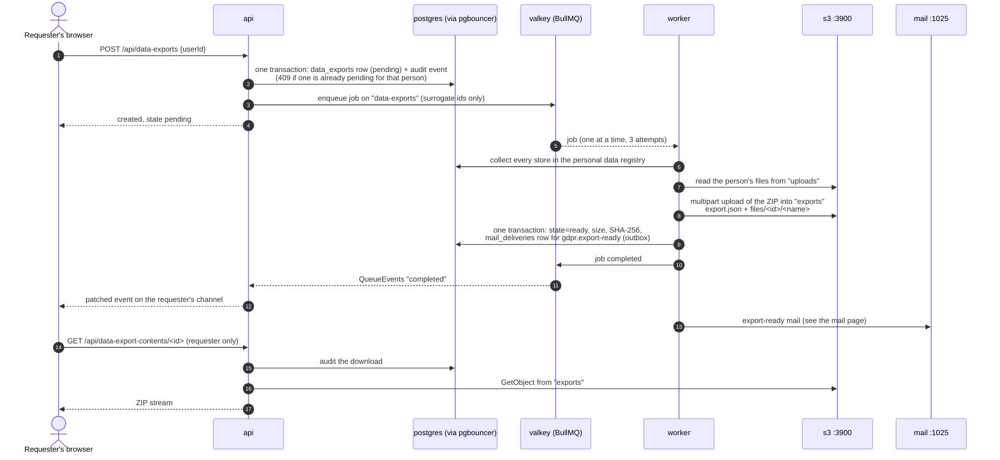
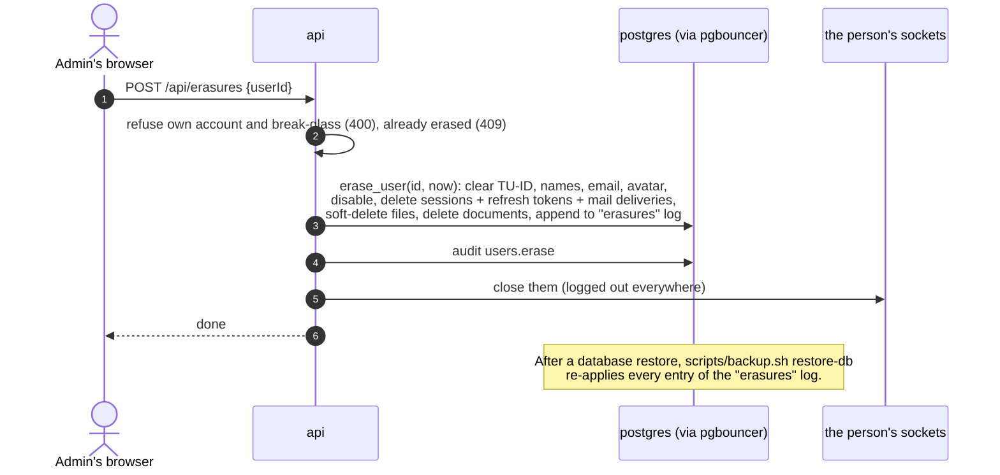

# GDPR export and erasure

Illustrates [0013](../0013-gdpr-export-and-retention.md), with the queue from [0024](../0024-background-jobs-bullmq.md), the notification from [0027](../0027-email-templates-and-sending.md) and the live update from [0012](../0012-role-scoped-channels.md). Where this page and an ADR or the code disagree, the ADR and the code win.

## Data subject export

The export expiry job deletes the object and then the row after the export retention (default 7 days); the `exports` bucket is never backed up.

## Erasure

