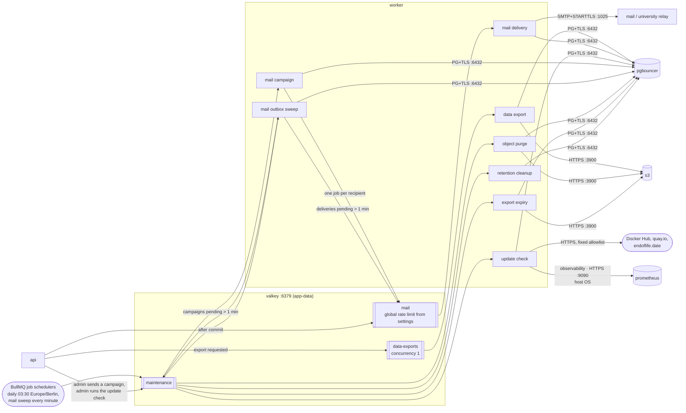
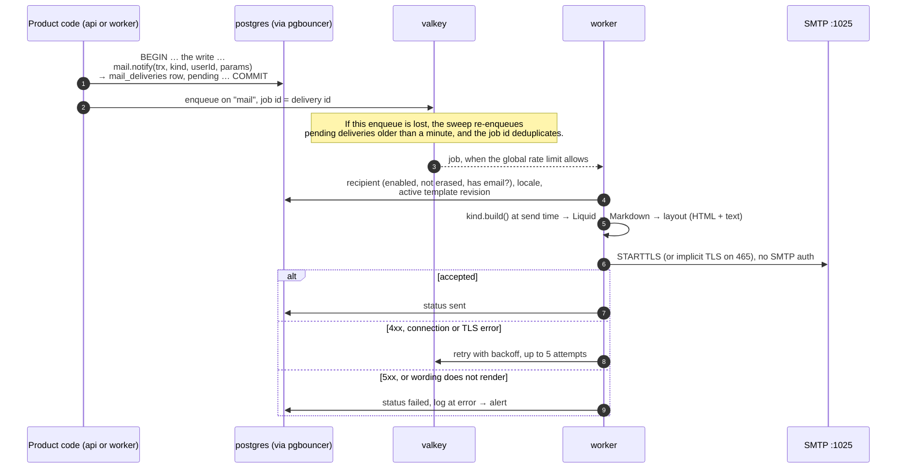
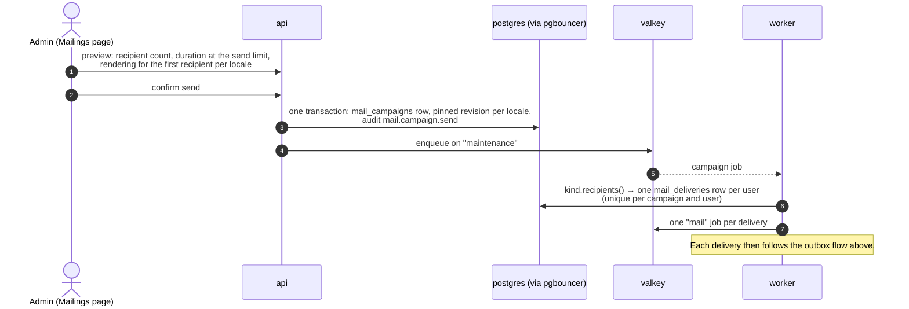

# Mail and background jobs

Illustrates [0024](../0024-background-jobs-bullmq.md), [0027](../0027-email-templates-and-sending.md) and the update check of [0032](../0032-system-info-and-update-check.md). Where this page and an ADR or the code disagree, the ADR and the code win.

The API only enqueues; the worker runs every job. Both reach Valkey on `app-data`, each with its own ACL user (`api`: `rl:` and `bull:` keys, `worker`: `bull:` only).

## Queues

## Notification through the outbox

A mail exists exactly when the write that causes it commits.

## Campaign

