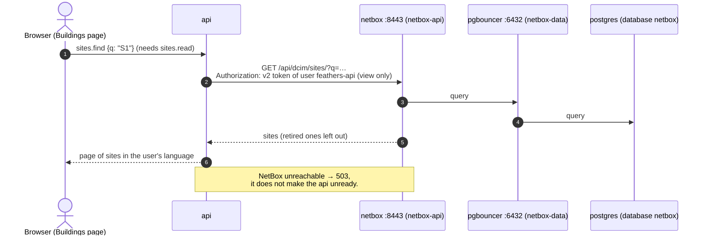
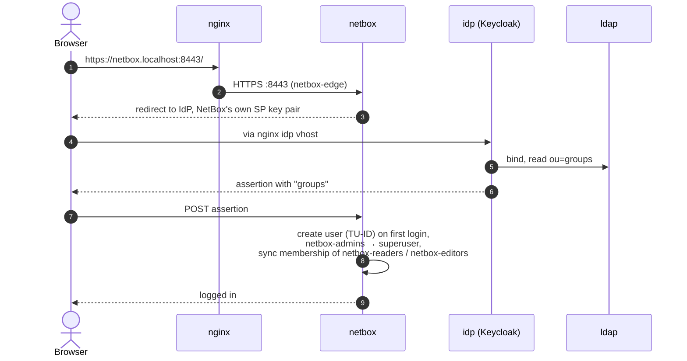
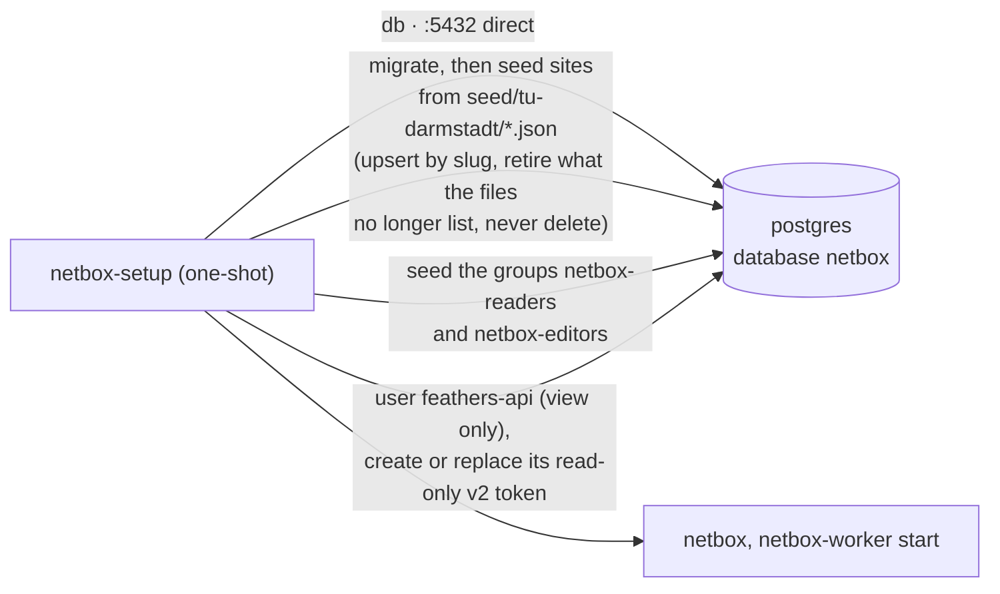

# NetBox: building lookup and NetBox login

Illustrates [0031](../0031-netbox-locations.md). Where this page and the ADR or the code disagree, the ADR and the code win.

NetBox sits on three networks of its own: `netbox-edge` (browsers via Nginx), `netbox-api` (the api) and `netbox-data` (its PgBouncer and Valkey access), so it has no route to the api or the worker.

## Building lookup from the application

## People logging in to NetBox

## Setup at every start

