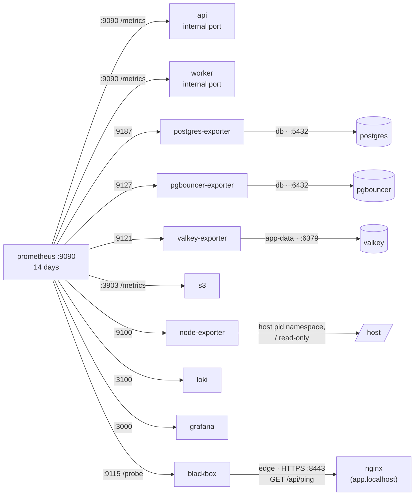
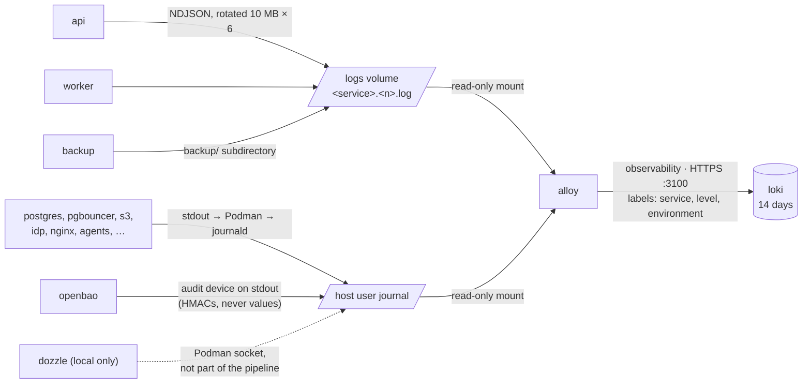
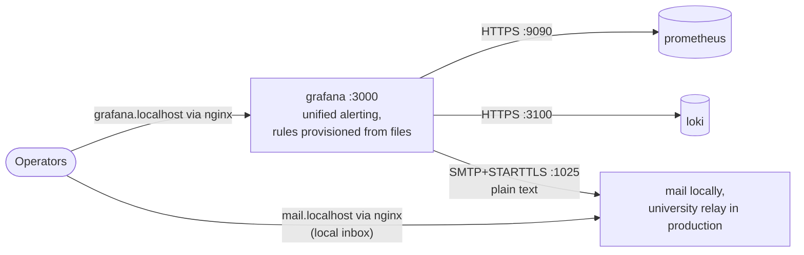

# Observability: metrics, logs and alerts

Illustrates [0021](../0021-structured-logging.md) and [0022](../0022-observability-and-alerting.md). Where this page and an ADR or the code disagree, the ADR and the code win. Every hop here is TLS, verified against the CA root.

## Metrics

Prometheus scrapes every target every 15 s on the `observability` network (`containers/prometheus/prometheus.yml`).

The API's `/health/ready` checks PgBouncer, Valkey and the `uploads` bucket; the same checks reach Prometheus as `dependency_up{dependency}`. The container healthcheck uses `/health/live` only, so a database outage never makes Podman restart the API.

## Logs

OpenBao's audit device is drawn as `containers/openbao/server.hcl` configures it: on stdout, "until the shared log volume exists". [0023](../0023-secrets-management.md) says the log volume.

## Alerts

| From Loki | From Prometheus |
| --- | --- |
| error lines, rate-limit rejections, break-glass logins, backup errors or no success in 26 h | target down, API not ready, 5xx ratio, p95 latency, DB connections, volume > 80 %, uptime probe, certificate expiry |
