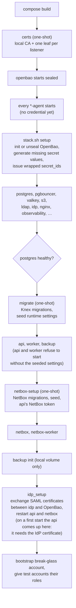
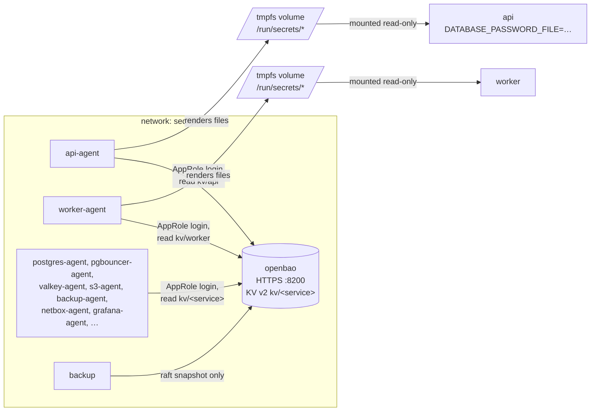
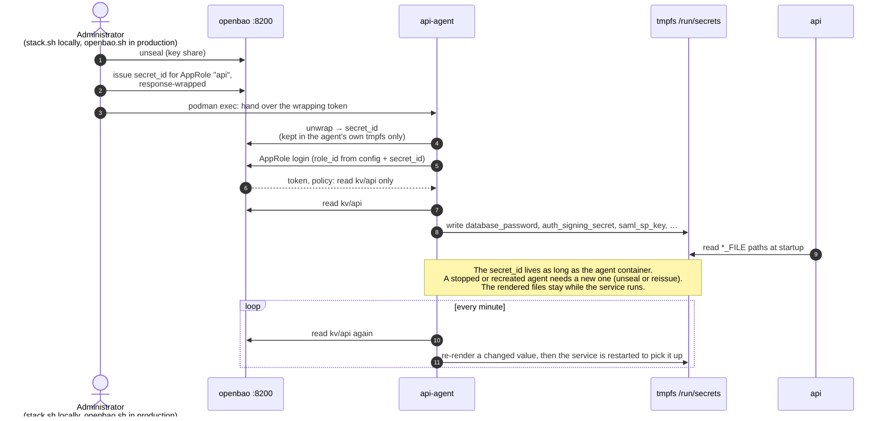

# Startup order and secret delivery

Illustrates [0023](../0023-secrets-management.md), [0016](../0016-nginx-and-tls-everywhere.md) (the `certs` job) and the start sequence of `scripts/stack.sh up`. Where this page and an ADR or the script disagree, the ADR and the code win.

## Start sequence

`depends_on` in `compose.yaml` covers part of the order; the rest is `scripts/stack.sh up`, because OpenBao must be unsealed and every agent given a `secret_id` before anything that reads a secret starts. In production an administrator does the unseal step with `scripts/openbao.sh unseal`, and systemd follows the same dependencies through the generated Quadlet units.

## Secret delivery

One OpenBao Agent per consuming service. The service itself is never on `secrets` and never talks to OpenBao; it reads files.

How an agent gets its first credential, and why a restarted agent needs a new one:

