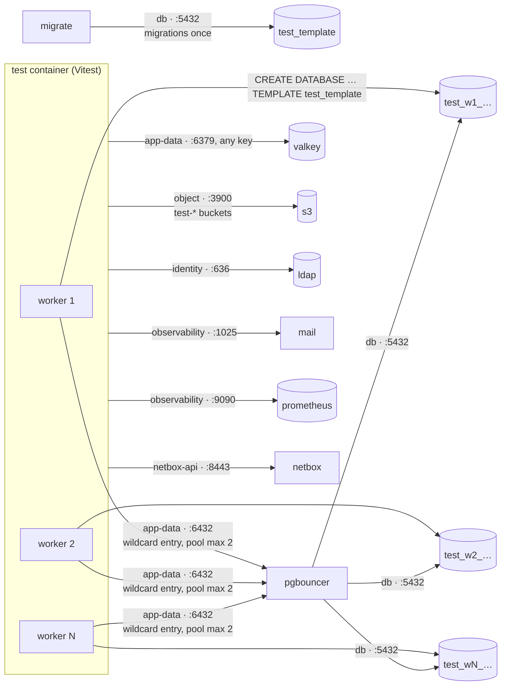
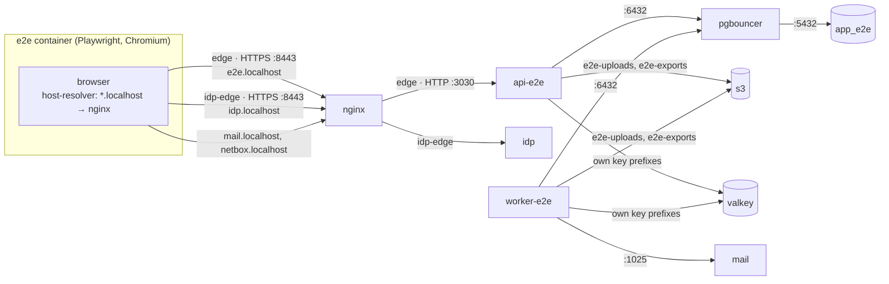
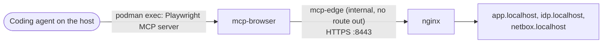

# Test topology

Illustrates [0015](../0015-testing-vitest-playwright.md) and [0026](../0026-mcp-development-tooling.md). Where this page and an ADR or the code disagree, the ADR and the code win. None of this exists in production.

## Integration tests: one database per test file

`test` sits where the api sits (`app-data`, `identity`, `object`, `netbox-api`, `observability`), so it cannot bypass PgBouncer either.

## End-to-end: a second api on its own database

Shared with the developer's stack: PostgreSQL, PgBouncer, Valkey, Keycloak, LDAP, Garage. Shared data: none.

## The coding agent's browser

