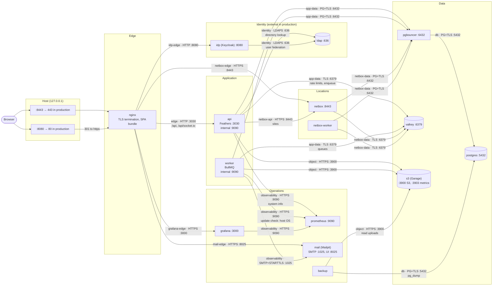
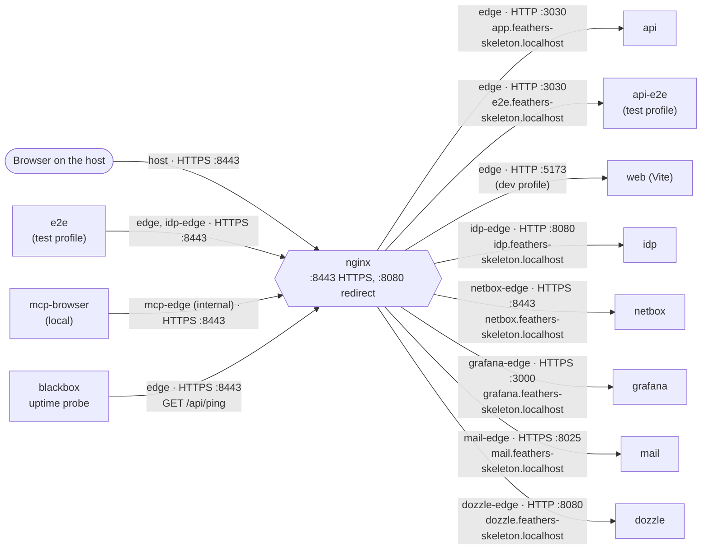

# Topology: who talks to whom, on which port and network

Illustrates [0002](../0002-service-inventory-and-networks.md), with ports from [0004](../0004-pgbouncer-pools.md), [0010](../0010-sessions-postgres-ratelimits-valkey.md), [0016](../0016-nginx-and-tls-everywhere.md), [0020](../0020-object-storage-uploads.md), [0022](../0022-observability-and-alerting.md), [0023](../0023-secrets-management.md), [0031](../0031-netbox-locations.md) and [0032](../0032-system-info-and-update-check.md), as configured in `compose.yaml`. If this page and an ADR or `compose.yaml` disagree, the ADR and the code win; fix this page.

Every arrow points from the client to the server and is labelled `network · protocol :port`. Only `nginx` publishes ports to the host.

## Overview

The long-running services by tier, with the hops of the request path and the data path. Observability and secret delivery have pages of their own: [observability](observability.md) and [startup and secrets](startup-and-secrets.md).

What the drawing does not show, and why:

- **nginx → api and nginx → idp are plain HTTP** on their private networks; every other hop above is TLS, verified against the local CA root ([0016](../0016-nginx-and-tls-everywhere.md)).
- **`web`** (Vite, `:5173`, `dev` profile only) replaces the bundle Nginx serves: `nginx → web` on `edge`.
- **`dozzle`** (`:8080`, local only) is reached from `nginx` on `dozzle-edge` and reads container output through the Podman socket.
- **One-shot jobs** `migrate` and `netbox-setup` connect directly to `postgres :5432` on `db`, like `backup`.
- **Outbound internet**: the worker's daily update check calls Docker Hub, quay.io and endoflife.date ([0032](../0032-system-info-and-update-check.md)); NetBox and every other service are configured not to call out.
- In production `idp`, `ldap` and `mail` are the university's services, reached at configured addresses rather than containers.

## The browser's path: edge networks

Each browser-facing UI has an edge network of its own shared only with Nginx, so a UI cannot reach any other.

Virtual hosts that exist only locally (`idp`, `e2e`, `mail`, `dozzle`) disappear from the production units because their host names are interpolated local values ([0016](../0016-nginx-and-tls-everywhere.md)).

## Listeners

| Service | Port | Protocol | Reached by | On network |
| --- | --- | --- | --- | --- |
| `nginx` | 8443 (443 in production) | HTTPS | host, `e2e`, `mcp-browser`, `blackbox` | published on `127.0.0.1`; `edge`, `idp-edge`, `mcp-edge` |
| `nginx` | 8080 (80 in production) | HTTP, 301 to HTTPS only | host | published on `127.0.0.1` |
| `web` | 5173 | HTTP (Vite) | `nginx` | `edge` |
| `api`, `api-e2e` | 3030 | HTTP + WebSocket | `nginx` | `edge` |
| `api`, `worker` (and e2e twins) | 9090 | HTTPS: `/metrics`, `/health/*` | `prometheus`, own healthcheck | `observability` |
| `pgbouncer` | 6432 | PostgreSQL, TLS required | `api`, `worker`, `test`, `api-e2e`, `worker-e2e` · `netbox`, `netbox-worker` · `pgbouncer-exporter` | `app-data` · `netbox-data` · `db` |
| `postgres` | 5432 | PostgreSQL, TLS | `pgbouncer`, `migrate`, `backup`, `netbox-setup`, `postgres-exporter` | `db` |
| `valkey` | 6379 | RESP, TLS only (`port 0`) | `api`, `worker` (and e2e twins), `test`, `valkey-exporter` · `netbox`, `netbox-worker` | `app-data` · `netbox-data` |
| `s3` | 3900 | HTTPS, S3 API | `api`, `worker` (and e2e twins), `backup`, `test` | `object` |
| `s3` | 3903 | HTTPS, `/metrics` and `/health` only | `prometheus` | `observability` |
| `ldap` | 636 | LDAPS | `api`, `api-e2e`, `test`, `idp` | `identity` |
| `idp` | 8080 | HTTP | `nginx` | `idp-edge` |
| `netbox` | 8443 | HTTPS (Granian) | `nginx` · `api`, `api-e2e`, `test` | `netbox-edge` · `netbox-api` |
| `openbao` | 8200 | HTTPS | every `*-agent`, `backup` | `secrets` |
| `prometheus` | 9090 | HTTPS | `grafana`, `api`, `worker` (and e2e twins), `test` | `observability` |
| `loki` | 3100 | HTTPS | `alloy`, `grafana`, `prometheus` | `observability` |
| `grafana` | 3000 | HTTPS | `nginx`, `prometheus` | `grafana-edge`, `observability` |
| `mail` | 1025 | SMTP, STARTTLS | `worker`, `worker-e2e`, `grafana`, `test` | `observability` |
| `mail` | 8025 | HTTPS, inbox UI | `nginx` | `mail-edge` |
| `postgres-exporter` | 9187 | HTTPS | `prometheus` | `observability` |
| `pgbouncer-exporter` | 9127 | HTTPS | `prometheus` | `observability` |
| `valkey-exporter` | 9121 | HTTPS | `prometheus` | `observability` |
| `node-exporter` | 9100 | HTTPS | `prometheus` | `observability` |
| `blackbox` | 9115 | HTTPS | `prometheus` | `observability` |
| `dozzle` | 8080 | HTTP | `nginx` | `dozzle-edge` |
| `alloy` | 12345 | HTTP, loopback only | nobody | — |

## Network membership

`●` member in every environment, `L` local only, `T` `test` profile only. Taken from `compose.yaml`; the agents are all on `secrets` and nothing else, and exist where their service does. `scripts/diagrams.sh` fails when this matrix or the listener table above no longer matches `compose.yaml`.

| Service | edge | idp-edge | dozzle-edge | grafana-edge | mail-edge | netbox-edge | mcp-edge | app-data | db | identity | object | netbox-api | netbox-data | secrets | observability |
| --- | --- | --- | --- | --- | --- | --- | --- | --- | --- | --- | --- | --- | --- | --- | --- |
| nginx | ● | ● | ● | ● | ● | ● | ● | | | | | | | | |
| web (dev) | ● | | | | | | | | | | | | | | |
| api | ● | | | | | | | ● | | ● | ● | ● | | | ● |
| worker | | | | | | | | ● | | | ● | | | | ● |
| pgbouncer | | | | | | | | ● | ● | | | | ● | | |
| postgres | | | | | | | | | ● | | | | | | |
| valkey | | | | | | | | ● | | | | | ● | | |
| s3 | | | | | | | | | | | ● | | | | ● |
| migrate | | | | | | | | | ● | | | | | | |
| backup | | | | | | | | | ● | | ● | | | ● | |
| openbao, `*-agent` | | | | | | | | | | | | | | ● | |
| ldap-agent, idp-agent | | | | | | | | | | | | | | L | |
| test-agent | | | | | | | | | | | | | | T | |
| netbox | | | | | | ● | | | | | | ● | ● | | |
| netbox-worker | | | | | | | | | | | | | ● | | |
| netbox-setup | | | | | | | | | ● | | | | ● | | |
| idp | | L | | | | | | | | L | | | | | |
| ldap | | | | | | | | | | L | | | | | |
| dozzle | | | L | | | | | | | | | | | | |
| mcp-browser | | | | | | | L | | | | | | | | |
| grafana | | | | ● | | | | | | | | | | | ● |
| mail | | | | | L | | | | | | | | | | L |
| prometheus, loki, alloy, node-exporter | | | | | | | | | | | | | | | ● |
| postgres-exporter, pgbouncer-exporter | | | | | | | | | ● | | | | | | ● |
| valkey-exporter | | | | | | | | ● | | | | | | | ● |
| blackbox | ● | | | | | | | | | | | | | | ● |
| test | | | | | | | | T | | T | T | T | | | T |
| e2e | T | T | | | | | | | | | | | | | |
| api-e2e | T | | | | | | | T | | T | T | T | | | T |
| worker-e2e | | | | | | | | T | | | T | | | | T |

Reading the matrix the way [0002](../0002-service-inventory-and-networks.md) does: `api` and `worker` have no `db` column, so they cannot bypass PgBouncer; `backup` has no `app-data`, so it cannot reach the API, the worker or Valkey; `s3` has no edge network, so object bytes leave only through the API.
