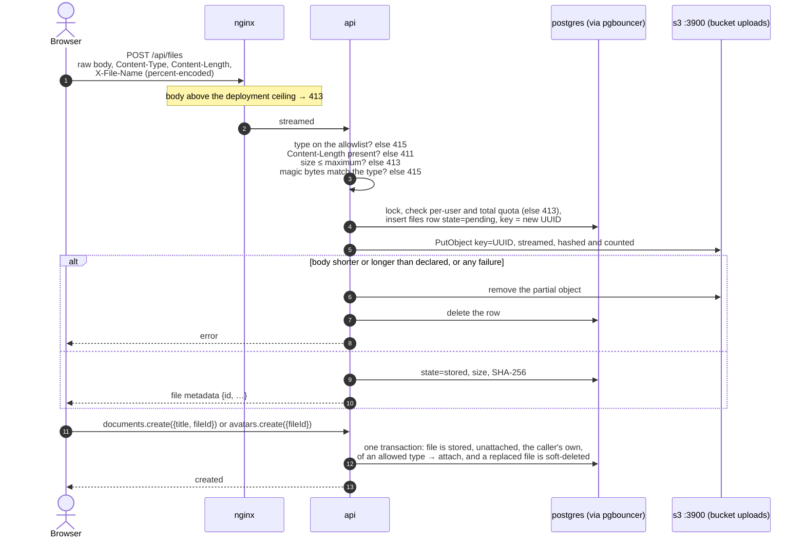
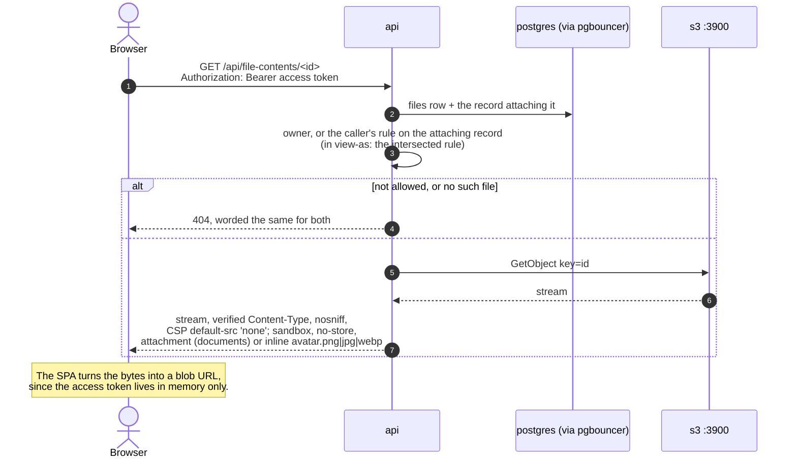
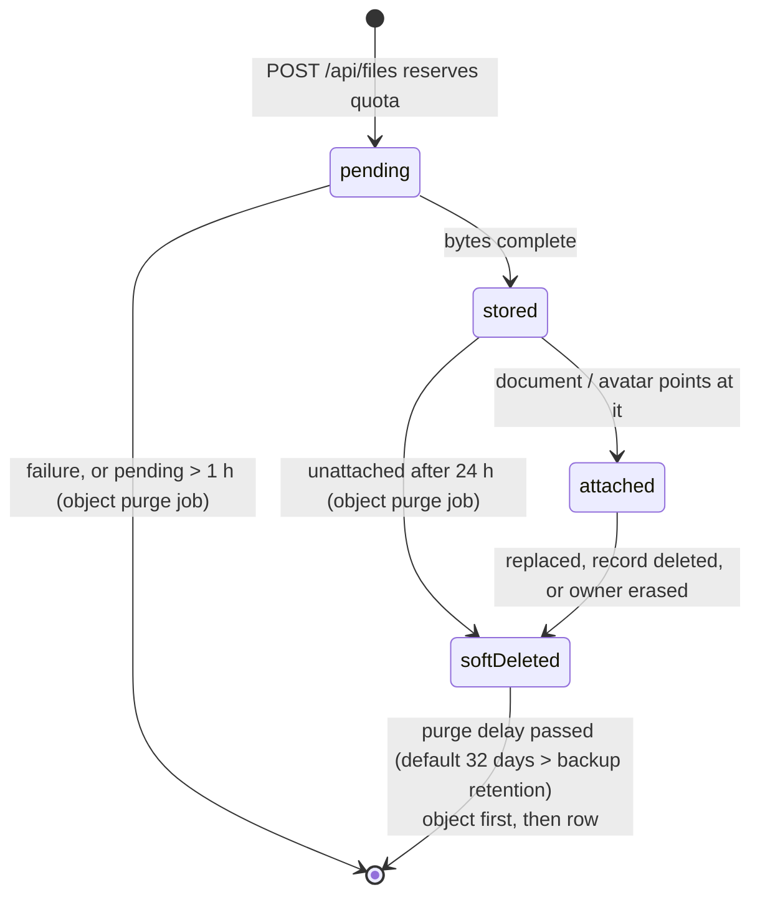

# File uploads and downloads

Illustrates [0020](../0020-object-storage-uploads.md), with authorization from [0011](../0011-casl-role-authorization.md). Where this page and an ADR or the code disagree, the ADR and the code win.

The browser never reaches the object store: `s3` is on `object` only, which Nginx is not on. Every byte goes through the API.

## Upload and attach

## Download

## Lifecycle of an object

Objects are written once and never modified; deletion is soft and the worker purges later. That is what lets the database and the bucket be backed up independently ([0017](../0017-nfs-backup-storage.md)).

The same daily purge also removes objects older than a day that no row describes. A row is always written before its object, so only a failure or a restore to an earlier database state leaves such objects, and nothing can reference them.
